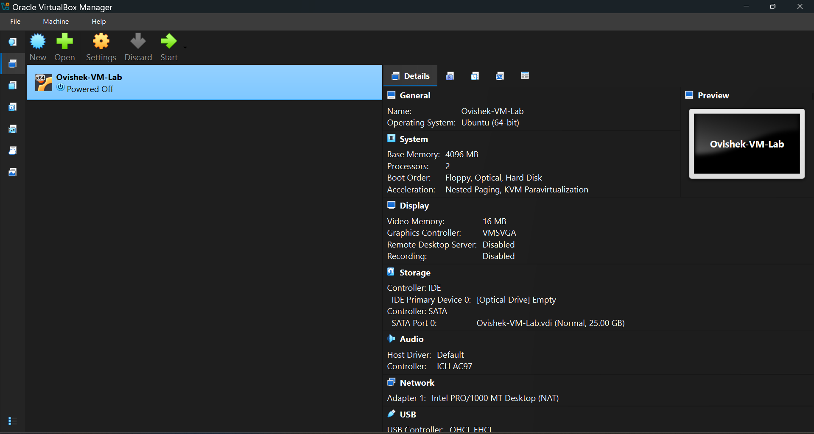
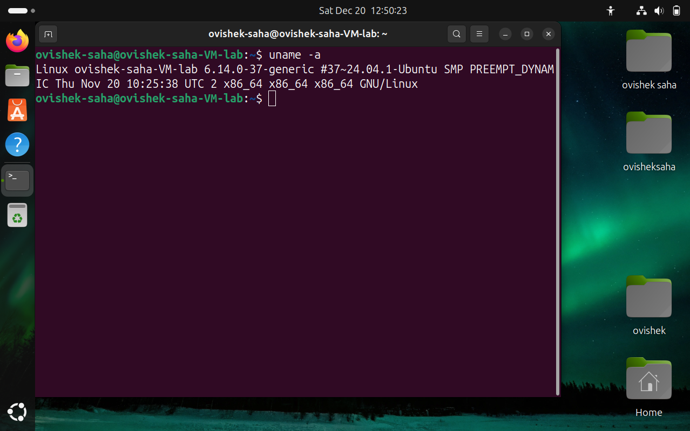

# Linux System Administration & Operations Lab
This repository serves as a technical log of my hands-on experience with Linux systems administration, focused on preparing for Remote IT Support and Systems Operations roles.

## 🖥️ Lab Environment: Workstation Creation
To facilitate hands-on learning, I built a dedicated Linux workstation from the ground up to simulate a remote server environment.

* **Hypervisor:** VirtualBox 7.x
* **Operating System:** Ubuntu 24.04 LTS
* **Allocated Resources:** 4096 MB RAM | 2 Processors | 25GB Dynamic Storage
* **Objective:** A sandbox environment for practicing system hardening, package troubleshooting, and remote administration.

## 🛠️ Technical Skills & Command Proof
I utilize the Command Line Interface (CLI) for all system management tasks. Below is a snapshot of the environment in action.

### Core Competencies Demonstrated:
* **System Administration:** User management (`chmod`, `chown`), process monitoring (`top`, `kill`), and resource management (`df`, `free`).
* **Network Operations:** Remote terminal access via SSH, connectivity troubleshooting (`ping`, `ip addr`), and service management (`systemctl`).
* **Package Management:** Proficient with APT and DPKG for software installation and dependency resolution.

## 🧪 Practical Labs Completed
1. **Security & Permissions:** Managed user account access and implemented directory-level security using numeric permissions (e.g., `750`).
2. **Remote Management:** Installed/initialized OpenSSH server and performed secure file transfers using **SCP**.
3. **Troubleshooting:** Identified and terminated resource-heavy processes using PIDs and `kill -9`.

## 🛠️ Command Reference & Technical Proficiency
To ensure operational efficiency, I have mastered the following core Linux commands, categorized by their use-cases in a production environment.

### 🔍 System Diagnosis & Navigation
* `uname -a` – Used to verify kernel version ($6.14.0$) and system architecture.
* `ls -la` – Visualizing directory structures and hidden configuration files.
* `pwd` – Confirming absolute paths during script execution and file management.

### 🔐 Security & Permission Management
* `chmod` – Managing read/write/execute permissions to secure sensitive data.
* `chown` – Assigning proper user/group ownership to system directories.
* `sudo` – Implementing administrative changes using the principle of least privilege.

### 📈 Resource & Process Monitoring
* `top` – Real-time monitoring of CPU and RAM distribution.
* `df -h` – Analyzing disk partition usage in human-readable formats.
* `free -m` – Monitoring memory consumption to troubleshoot performance bottlenecks.
* `kill -9` – Force-terminating unresponsive or "zombie" processes via PIDs.

### 🌐 Network Operations
* `ip addr` – Identifying network interfaces and local IP assignments.
* `ping` – Diagnosing network latency and server reachability.
* `ssh` – (Practiced) Establishing secure remote connections for off-site administration.

## 📝 Learning Philosophy
I am committed to technical honesty and precision. I document my workflows to build a reliable foundation for managing remote infrastructure and supporting global teams.
